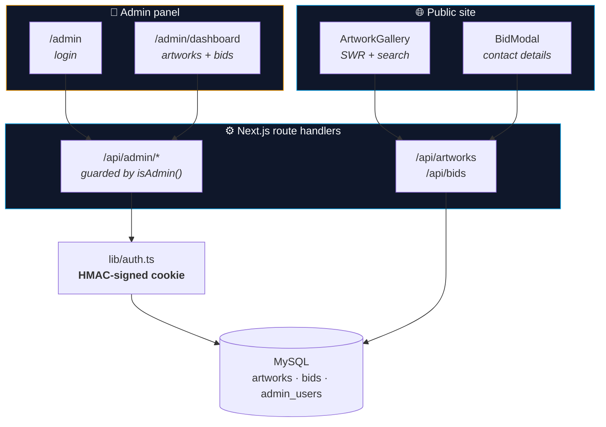
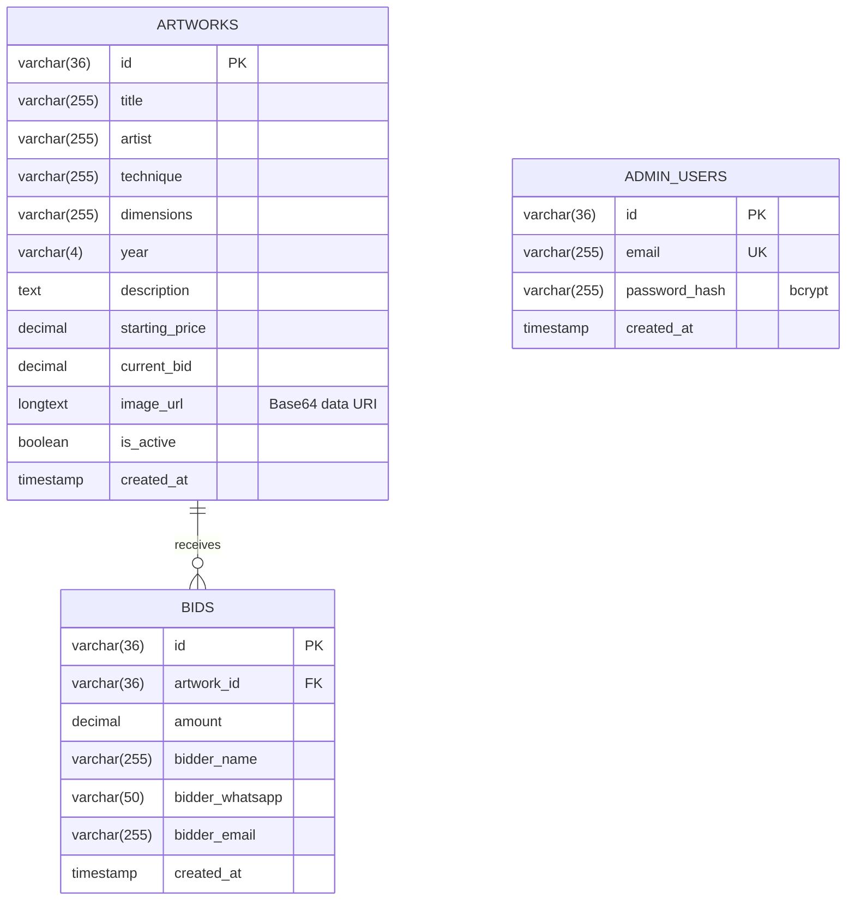

<div align="center">


# Art Auction for a Cause

**A charity auction platform for TECHO Oaxaca.**
Every piece sold funds progressive housing for families living in vulnerable conditions.

Public catalogue, contact-based bidding (no payment gateway) and an admin panel,
built on **Next.js 16** with **MySQL**.

[](https://www.techoax.art/)

[](https://github.com/JaredPS03/TECHO/actions/workflows/ci.yml)
[](https://nextjs.org/)
[](https://react.dev/)
[](https://www.typescriptlang.org/)
[](https://tailwindcss.com/)
[](https://www.mysql.com/)

[Español](README.md) · **English** · [Documentation](docs/)

</div>

---

## 📑 Table of contents

- [The project](#-the-project)
- [How it works](#-how-it-works)
- [Features](#-features)
- [Tech stack](#-tech-stack)
- [Architecture](#️-architecture)
- [Data model](#-data-model)
- [Security](#-security)
- [API](#-api)
- [Running locally](#-running-locally)
- [Deployment](#-deployment)
- [Engineering decisions](#-engineering-decisions)
- [Known limitations](#️-known-limitations)
- [Roadmap](#️-roadmap)
- [License](#-license)

---

## 🎯 The project

[TECHO](https://techo.org) builds progressive housing alongside families living in vulnerable conditions. To fund
construction in the city of Oaxaca, the organization auctions artwork donated by local artists.

That auction used to run by hand: pieces circulated over messaging apps, bids arrived scattered across WhatsApp,
and someone had to keep manual track of who was winning which piece.

**This platform replaces that process.** It publishes the catalogue with each piece's current bid, captures bids
along with the bidder's contact details, and gives the organization a panel where everything is ordered and
artworks can be managed without touching the database.

Live in production today: **14 published artworks**, each with technique, dimensions, year and starting price.

## 🔄 How it works

The product decision that defines the system: **there is no payment gateway**. Bidding is *contact-based*.

```
1. A visitor browses the catalogue and sees each piece's current bid
2. They bid: name, WhatsApp and email. The bid must beat the current one by at least $500
3. The bid is recorded and the artwork's price updates immediately
4. The organization sees every bid in the panel, ordered by date
5. When the auction closes, they reach the winner on WhatsApp and settle off-platform
```

Not processing payments was deliberate: it spares a nonprofit the fees, the paperwork and the legal
responsibility of handling other people's money, and closing personally over WhatsApp was already how they
worked. The platform solves what actually hurt — losing track of bids — rather than what would have sounded more
impressive.

---

## ✨ Features

### Public site

| | Feature | Detail |
| :--- | :--- | :--- |
| 🖼 | **Artwork catalogue** | Title, artist, technique, dimensions, year and starting price |
| 💰 | **Minimum bid** | Every bid must beat the current one by $500, enforced server-side inside a transaction |
| 🔍 | **Search** | Live filtering by piece, artist or technique |
| 🔎 | **Zoom view** | Full-screen modal to inspect a piece |
| 💾 | **Remembered details** | Contact details are kept in `localStorage` and pre-fill the next bid |
| 📱 | **Responsive** | Mobile-first: most bids arrive from a phone |

### Admin panel

| | Feature | Detail |
| :--- | :--- | :--- |
| 🔐 | **Protected access** | bcrypt password hashing and an HMAC-signed session cookie |
| ✏️ | **Artwork management** | Create, edit, delete and activate/deactivate without touching the database |
| 📤 | **Image upload** | MIME type and size validation (5 MB max), stored as Base64 |
| 📋 | **Bid list** | Every bid with its contact details, filterable by artwork |
| 🔄 | **Auto refresh** | The bid list refreshes every 10 s while the auction runs |

---

## 🛠 Tech stack

| Layer | Technology | Why |
| :--- | :--- | :--- |
| **Framework** | Next.js 16 (App Router) | Client and API in one deployment; right-sized for the actual problem |
| **UI** | React 19 · TypeScript 5.7 | Strict typing end to end (**0 `tsc` errors**) |
| **Styling** | Tailwind CSS v4 · shadcn/ui (Radix) | Accessible components without a heavy component library |
| **Data** | MySQL 8 (`mysql2/promise`) | The nonprofit already had hosting with MySQL included; no added cost |
| **Remote state** | SWR | Declarative revalidation and refresh without hand-rolled fetching |
| **Auth** | bcryptjs · HMAC-SHA256 | Password hashing and a signed session, with no third-party dependency |
| **CI** | GitHub Actions | Type-check and build on every push and pull request |
| **Deployment** | Vercel + remote MySQL | App on Vercel, database on the nonprofit's existing hosting |

---

## 🏗️ Architecture



It is a deliberate monolith. With three tables, fourteen artworks and a small organization behind it, splitting
services would have added operations nobody was going to maintain. All business logic lives in the route
handlers, and the only shared state is the database.

> 📄 The decisions and their rationale in detail: [`docs/ARCHITECTURE.md`](docs/ARCHITECTURE.md).

---

## 🗄 Data model

Three tables. The full schema is in [`database.sql`](database.sql).



`bids` keeps the full history: every bid is recorded even after a higher one arrives, and
`artworks.current_bid` is the derived value the catalogue displays. Deleting an artwork removes its bids
(`ON DELETE CASCADE`).

> 📄 Column, index and query details: [`docs/DATABASE.md`](docs/DATABASE.md).

---

## 🔒 Security

| Measure | Implementation |
| :--- | :--- |
| **Passwords** | bcrypt at cost 12; the plaintext password is never stored or logged |
| **Admin session** | `httpOnly` + `secure` + `sameSite` cookie carrying `<adminId>.<expiry>.<HMAC-SHA256>` signed with `SESSION_SECRET` |
| **Signature comparison** | `crypto.timingSafeEqual`, so response timing leaks nothing |
| **SQL injection** | Every query uses `mysql2` parameter placeholders; user input is never concatenated |
| **User enumeration** | Login answers identically for an unknown user and a wrong password |
| **Errors** | Detail goes to the server log; the client gets a generic message |
| **File upload** | MIME type allow-list and a 5 MB ceiling |
| **HTTP headers** | `Strict-Transport-Security`, `X-Frame-Options`, `X-Content-Type-Options`, `Referrer-Policy` in [`next.config.mjs`](next.config.mjs) |
| **Race condition** | Bids are validated inside a transaction using `SELECT ... FOR UPDATE` |

What is **not** solved yet is listed plainly under [Known limitations](#️-known-limitations).

---

## 🔌 API

14 route handlers. Everything under `/api/admin/*` requires a valid session; the rest is public.

<details>
<summary><b>Public endpoints</b></summary>

| Method | Route | Description |
| :--- | :--- | :--- |
| `GET` | `/api/artworks` | Catalogue of active artworks, newest first |
| `POST` | `/api/bids` | Record a bid together with the bidder's contact details |

</details>

<details>
<summary><b>Admin endpoints</b></summary>

| Method | Route | Description |
| :--- | :--- | :--- |
| `POST` | `/api/admin/login` | Sign in; issues the signed cookie |
| `POST` | `/api/admin/logout` | Sign out |
| `GET` | `/api/admin/session` | Check the current session |
| `GET` `POST` | `/api/admin/artworks` | List (including inactive) and create artworks |
| `PUT` `DELETE` | `/api/admin/artworks/[id]` | Edit and delete an artwork |
| `GET` | `/api/admin/bids` | Every bid with its associated artwork |
| `POST` | `/api/admin/upload` | Convert an image into a Base64 data URI |
| `POST` | `/api/migrate` | One-off schema migration (admin only) |

</details>

> 📄 Payloads, responses and error codes: [`docs/API.md`](docs/API.md).

---

## 🚀 Running locally

### Requirements

- **Node.js** 20 or newer
- **MySQL** 8 (or MariaDB) — XAMPP works

### Steps

```bash
# 1 — Clone
git clone https://github.com/JaredPS03/TECHO.git
cd TECHO

# 2 — Install dependencies
pnpm install

# 3 — Configure the environment
cp .env.example .env
#    Fill in your MySQL details and generate a SESSION_SECRET:
#    node -e "console.log(require('crypto').randomBytes(32).toString('hex'))"

# 4 — Create the database and tables
pnpm db:setup

# 5 — Create your admin user
ADMIN_EMAIL=you@example.com ADMIN_PASSWORD='a-long-password' pnpm db:admin

# 6 — Start
pnpm dev
```

Public site at <http://localhost:3000>, admin panel at <http://localhost:3000/admin>.

### Environment variables

| Variable | Required | Description |
| :--- | :---: | :--- |
| `MYSQL_HOST` | ✅ | MySQL server |
| `MYSQL_PORT` | ➖ | Port (defaults to `3306`) |
| `MYSQL_USER` | ✅ | Database user |
| `MYSQL_PASSWORD` | ✅ | Database password |
| `MYSQL_DATABASE` | ✅ | Database name (defaults to `techo`) |
| `SESSION_SECRET` | ✅ | Random string of 32+ characters signing the session cookie. **Without it the admin panel cannot sign in** |

> ⚠️ `.env` is git-ignored and must never be committed. Use `.env.example` as the template.

### Commands

```bash
pnpm dev          # Development server
pnpm build        # Production build
pnpm start        # Serve the production build
pnpm typecheck    # TypeScript check
pnpm db:setup     # Create database and tables from database.sql
pnpm db:admin     # Create or update an admin user
```

---

## 📦 Deployment

The app runs on **Vercel** and the database on the **remote MySQL** of the hosting the organization already had.
The step-by-step guide — including enabling remote MySQL access and the variables to declare in Vercel — is in
[`docs/DEPLOYMENT.md`](docs/DEPLOYMENT.md) (written in Spanish).

---

## 🧠 Engineering decisions

<details>
<summary><b>1. Contact-based bidding, no payment gateway</b></summary>

<br>

Integrating payments would have meant fees, merchant registration, payment reconciliation and legal
responsibility over donors' money — all for an organization with no technical staff that already closed deals
over WhatsApp.

The platform solves the problem that genuinely existed (losing track of who bid on what) and leaves the closing
where it already worked. The result is a system the nonprofit can operate on its own.

</details>

<details>
<summary><b>2. Base64 images inside MySQL</b></summary>

<br>

Artworks are stored as data URIs in a `LONGTEXT` column rather than as files.

The reason was infrastructural: no object storage was available, Vercel's filesystem is ephemeral, and the
previous attempt — a PHP proxy on the hosting to receive uploads — added one more moving part that could break.
Putting the bytes in the row removed that dependency entirely: no external service, no expiring URLs, and a
database backup contains the images too.

**It carries a measurable cost, and not a small one:** the catalogue weighs **6.26 MB for 14 artworks** (458 KB
per image on average). It is documented under [Known limitations](#️-known-limitations) with its remediation plan.

</details>

<details>
<summary><b>3. A signed session cookie, not a raw identifier</b></summary>

<br>

The session used to hold the admin's UUID verbatim, and the server merely checked that the id existed in the
database. That confirms the id is real, but **not** that we issued the cookie: anyone who obtained or guessed the
identifier was signed in as an administrator.

The cookie is now `<adminId>.<expiry>.<HMAC-SHA256>` signed with `SESSION_SECRET`, the signature is compared in
constant time, and the expiry lives inside the signed value. No new dependencies: just `node:crypto`.

</details>

<details>
<summary><b>4. Bids are settled inside a transaction</b></summary>

<br>

Checking "does this bid beat the minimum?" and writing the new price were two separate operations. With two
people bidding at once, both could read the same `current_bid`, both clear the minimum, and the second write
would **lower** the artwork's price.

The endpoint now opens a transaction and locks the row with `SELECT ... FOR UPDATE`, making the read-check-write
sequence atomic. In an auction, the price must never go backwards.

</details>

<details>
<summary><b>5. Errors do not travel to the client</b></summary>

<br>

Every handler returned `error.message` in its 500 responses, exposing SQL, table names and connection details to
anyone who could trigger a failure. The real error now goes to the server log and the client receives a generic
message ([`lib/http.ts`](lib/http.ts)).

</details>

<details>
<summary><b>6. Type validation enabled in the build</b></summary>

<br>

The project carried `typescript.ignoreBuildErrors: true` from its initial scaffold, and that hid two real errors —
one of them an `import` of a module that does not exist, surviving only because it was type-only. With both fixed,
the flag was removed: a type error now breaks the build, locally and in CI.

</details>

---

## ⚠️ Known limitations

Stated on purpose. An honest project is worth more than one that pretends.

| Limitation | Impact | Plan |
| :--- | :--- | :--- |
| **6.26 MB catalogue** | Base64 images ride along on every catalogue request. Mitigated by dropping polling from 5 s to 60 s, but the initial load is still heavy on mobile | Serve each image from its own cacheable endpoint and keep the list to metadata |
| **No automated tests** | No safety net against regressions; CI only validates types and the build | Tests for the bid handlers and session verification |
| **A single role** | Every admin can do everything; there is no audit of who changed what | Action log and differentiated roles |
| **No rate limiting** | `/api/bids` accepts bids with no frequency restriction | Per-IP limiting |
| **Manual closing** | The auction has no end date in the system; it closes by deactivating artworks by hand | Per-artwork closing date |

---

## 🗺️ Roadmap

- [x] Public catalogue with search and minimum bid
- [x] Admin panel managing artworks and bids
- [x] bcrypt authentication with a signed session
- [x] Atomic bids via transaction
- [x] Security headers and sanitized error responses
- [x] CI pipeline (type-check and build)
- [ ] Images on their own endpoint with HTTP caching
- [ ] Automated tests for the critical endpoints
- [ ] Per-artwork closing date and automatic winner notification
- [ ] Rate limiting on the bid endpoint

---

## 📄 License

**© 2026 Jared Silva. All rights reserved.**

Public repository for portfolio and technical-evaluation purposes. The code is **not** open source.
See [`LICENSE`](LICENSE).

---

<div align="center">

**Jared Silva** · [GitHub @JaredPS03](https://github.com/JaredPS03)

</div>
