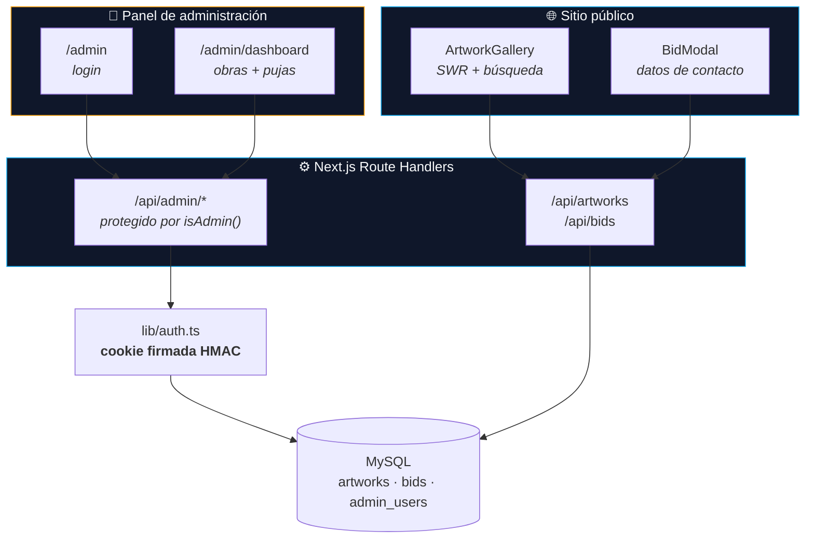
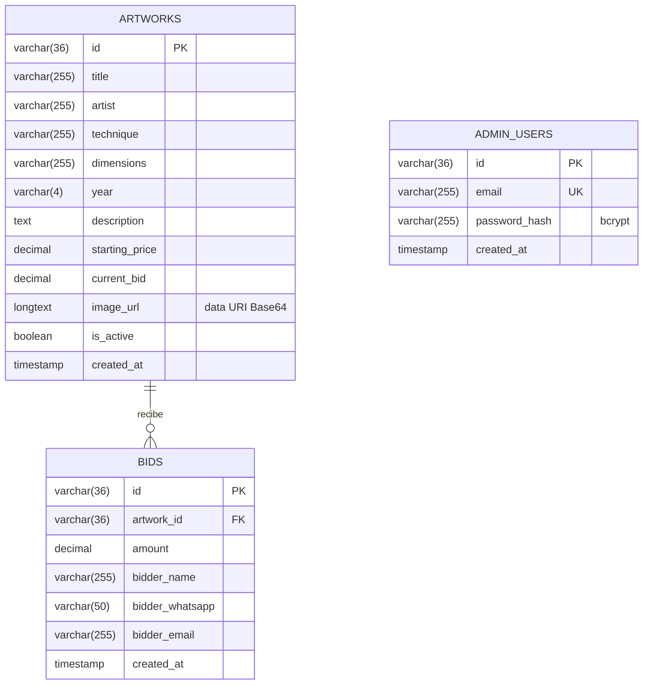

<div align="center">


# Subasta de Arte con Causa

**Plataforma de subasta benéfica para TECHO Oaxaca.**
Cada obra vendida financia la construcción de viviendas progresivas para familias en situación de vulnerabilidad.

Catálogo público, pujas por contacto (sin pasarela de pago) y panel de administración,
sobre **Next.js 16** con **MySQL**.

[](https://www.techoax.art/)

[](https://github.com/JaredPS03/TECHO/actions/workflows/ci.yml)
[](https://nextjs.org/)
[](https://react.dev/)
[](https://www.typescriptlang.org/)
[](https://tailwindcss.com/)
[](https://www.mysql.com/)

**Español** · [English](README.en.md) · [Documentación](docs/)

</div>

---

## 📑 Tabla de contenidos

- [El proyecto](#-el-proyecto)
- [Cómo funciona](#-cómo-funciona)
- [Características](#-características)
- [Stack tecnológico](#-stack-tecnológico)
- [Arquitectura](#️-arquitectura)
- [Modelo de datos](#-modelo-de-datos)
- [Seguridad](#-seguridad)
- [API](#-api)
- [Instalación local](#-instalación-local)
- [Despliegue](#-despliegue)
- [Decisiones técnicas](#-decisiones-técnicas)
- [Límites conocidos](#️-límites-conocidos)
- [Roadmap](#️-roadmap)
- [Licencia](#-licencia)

---

## 🎯 El proyecto

[TECHO](https://techo.org) construye viviendas progresivas junto a familias en situación de vulnerabilidad.
Para financiar las obras en la ciudad de Oaxaca, la organización subasta obras donadas por artistas locales.

Esa subasta se hacía de forma manual: las obras circulaban por mensajería, las pujas llegaban sueltas por
WhatsApp y alguien tenía que llevar la cuenta a mano de quién iba ganando cada pieza.

**Esta plataforma reemplaza ese proceso.** Publica el catálogo con la puja actual de cada obra, recoge las pujas
con los datos de contacto del interesado, y le da a la organización un panel donde ve todo ordenado y puede
gestionar las obras sin tocar la base de datos.

En producción hoy: **14 obras publicadas**, con técnica, dimensiones, año y precio de salida.

## 🔄 Cómo funciona

La decisión de producto que define el sistema: **no hay pasarela de pago**. La subasta es *por contacto*.

```
1. El visitante explora el catálogo y ve la puja actual de cada obra
2. Puja: deja nombre, WhatsApp y correo. Su puja debe superar la actual en al menos $500
3. La puja queda registrada y la obra actualiza su precio al instante
4. La organización ve todas las pujas en el panel, ordenadas por fecha
5. Al cerrar la subasta, contacta al ganador por WhatsApp y cierra el trato fuera de la plataforma
```

No procesar pagos fue deliberado: evita a una ONG el coste, el papeleo y la responsabilidad legal de manejar
dinero de terceros, y el cierre personal por WhatsApp ya era como trabajaban. La plataforma resuelve lo que
realmente dolía —el seguimiento de las pujas—, no lo que sonaba más impresionante.

---

## ✨ Características

### Público

| | Característica | Detalle |
| :--- | :--- | :--- |
| 🖼 | **Catálogo de obras** | Título, artista, técnica, dimensiones, año y precio de salida |
| 💰 | **Puja mínima** | Cada puja debe superar la actual en $500, validado en el servidor dentro de una transacción |
| 🔍 | **Búsqueda** | Filtrado en vivo por obra, artista o técnica |
| 🔎 | **Vista ampliada** | Modal a pantalla completa para ver la obra en detalle |
| 💾 | **Datos recordados** | Los datos de contacto se guardan en `localStorage` y precargan la siguiente puja |
| 📱 | **Responsive** | Diseñado para móvil primero: la mayoría de pujas llegan desde el teléfono |

### Panel de administración

| | Característica | Detalle |
| :--- | :--- | :--- |
| 🔐 | **Acceso protegido** | Contraseñas con bcrypt y sesión en cookie firmada con HMAC |
| ✏️ | **Gestión de obras** | Alta, edición, borrado y activar/desactivar sin tocar la base de datos |
| 📤 | **Carga de imágenes** | Validación de tipo y tamaño (máx. 5 MB), almacenadas como Base64 |
| 📋 | **Listado de pujas** | Todas las pujas con sus datos de contacto, filtrables por obra |
| 🔄 | **Refresco automático** | El listado de pujas se actualiza cada 10 s durante la subasta |

---

## 🛠 Stack tecnológico

| Capa | Tecnología | Por qué |
| :--- | :--- | :--- |
| **Framework** | Next.js 16 (App Router) | Cliente y API en un solo despliegue; suficiente para el tamaño real del problema |
| **UI** | React 19 · TypeScript 5.7 | Tipado estricto de extremo a extremo (**0 errores de `tsc`**) |
| **Estilos** | Tailwind CSS v4 · shadcn/ui (Radix) | Componentes accesibles sin arrastrar una librería pesada |
| **Datos** | MySQL 8 (`mysql2/promise`) | La ONG ya tenía hosting con MySQL incluido; cero coste adicional |
| **Estado remoto** | SWR | Revalidación y refresco declarativos sin gestionar peticiones a mano |
| **Autenticación** | bcryptjs · HMAC-SHA256 | Hash de contraseñas y sesión firmada, sin dependencias de terceros |
| **CI** | GitHub Actions | Type-check y build en cada push y pull request |
| **Despliegue** | Vercel + MySQL remoto | Aplicación en Vercel, base de datos en el hosting existente de la ONG |

---

## 🏗️ Arquitectura



Es un monolito deliberado. Con tres tablas, catorce obras y una organización pequeña detrás, separar servicios
habría añadido operaciones que nadie iba a mantener. Toda la lógica de negocio vive en los *route handlers*, y el
único estado compartido es la base de datos.

> 📄 Las decisiones y sus porqués, en detalle: [`docs/ARCHITECTURE.md`](docs/ARCHITECTURE.md).

---

## 🗄 Modelo de datos

Tres tablas. El esquema completo está en [`database.sql`](database.sql).



`bids` guarda el histórico completo: cada puja queda registrada aunque después llegue otra mayor, y
`artworks.current_bid` es el valor derivado que el catálogo muestra. Borrar una obra arrastra sus pujas
(`ON DELETE CASCADE`).

> 📄 Detalle de columnas, índices y consultas: [`docs/DATABASE.md`](docs/DATABASE.md).

---

## 🔒 Seguridad

| Medida | Implementación |
| :--- | :--- |
| **Contraseñas** | bcrypt con coste 12; nunca se almacena ni se registra la contraseña en claro |
| **Sesión de administración** | Cookie `httpOnly` + `secure` + `sameSite`, con `<adminId>.<expiración>.<HMAC-SHA256>` firmado con `SESSION_SECRET` |
| **Comparación de firmas** | `crypto.timingSafeEqual`, para no filtrar información por tiempo de respuesta |
| **Inyección SQL** | Todas las consultas usan `?` parametrizado de `mysql2`; no se concatena entrada de usuario |
| **Enumeración de usuarios** | Login responde igual ante usuario inexistente y contraseña incorrecta |
| **Errores** | El detalle va al log del servidor; el cliente recibe un mensaje genérico |
| **Subida de archivos** | Lista blanca de tipos MIME y límite de 5 MB |
| **Cabeceras HTTP** | `Strict-Transport-Security`, `X-Frame-Options`, `X-Content-Type-Options`, `Referrer-Policy` en [`next.config.mjs`](next.config.mjs) |
| **Condición de carrera** | Las pujas se validan dentro de una transacción con `SELECT ... FOR UPDATE` |

Lo que **todavía no** está resuelto está listado sin adornos en [Límites conocidos](#️-límites-conocidos).

---

## 🔌 API

14 *route handlers*. Los de `/api/admin/*` exigen sesión válida; el resto es público.

<details>
<summary><b>Endpoints públicos</b></summary>

| Método | Ruta | Descripción |
| :--- | :--- | :--- |
| `GET` | `/api/artworks` | Catálogo de obras activas, más recientes primero |
| `POST` | `/api/bids` | Registrar una puja con los datos de contacto del interesado |

</details>

<details>
<summary><b>Endpoints de administración</b></summary>

| Método | Ruta | Descripción |
| :--- | :--- | :--- |
| `POST` | `/api/admin/login` | Iniciar sesión; emite la cookie firmada |
| `POST` | `/api/admin/logout` | Cerrar sesión |
| `GET` | `/api/admin/session` | Comprobar la sesión actual |
| `GET` `POST` | `/api/admin/artworks` | Listar (incluidas las inactivas) y crear obras |
| `PUT` `DELETE` | `/api/admin/artworks/[id]` | Editar y eliminar una obra |
| `GET` | `/api/admin/bids` | Todas las pujas con su obra asociada |
| `POST` | `/api/admin/upload` | Convertir una imagen a data URI Base64 |
| `POST` | `/api/migrate` | Migración puntual del esquema (admin) |

</details>

> 📄 Payloads, respuestas y códigos de error: [`docs/API.md`](docs/API.md).

---

## 🚀 Instalación local

### Requisitos

- **Node.js** 20 o superior
- **MySQL** 8 (o MariaDB) — vale XAMPP

### Pasos

```bash
# 1 — Clonar
git clone https://github.com/JaredPS03/TECHO.git
cd TECHO

# 2 — Instalar dependencias
pnpm install

# 3 — Configurar el entorno
cp .env.example .env
#    Edita .env con tus datos de MySQL y genera un SESSION_SECRET:
#    node -e "console.log(require('crypto').randomBytes(32).toString('hex'))"

# 4 — Crear la base de datos y las tablas
pnpm db:setup

# 5 — Crear tu usuario administrador
ADMIN_EMAIL=tu@correo.com ADMIN_PASSWORD='una-contraseña-larga' pnpm db:admin

# 6 — Arrancar
pnpm dev
```

Sitio público en <http://localhost:3000> y panel en <http://localhost:3000/admin>.

### Variables de entorno

| Variable | Obligatoria | Descripción |
| :--- | :---: | :--- |
| `MYSQL_HOST` | ✅ | Servidor MySQL |
| `MYSQL_PORT` | ➖ | Puerto (por defecto `3306`) |
| `MYSQL_USER` | ✅ | Usuario de la base de datos |
| `MYSQL_PASSWORD` | ✅ | Contraseña del usuario |
| `MYSQL_DATABASE` | ✅ | Nombre de la base de datos (por defecto `techo`) |
| `SESSION_SECRET` | ✅ | Cadena aleatoria de 32+ caracteres que firma la cookie de sesión. **Sin ella el panel no deja iniciar sesión** |

> ⚠️ `.env` está en `.gitignore` y nunca debe subirse. Usa `.env.example` como plantilla.

### Comandos

```bash
pnpm dev          # Servidor de desarrollo
pnpm build        # Build de producción
pnpm start        # Servir el build
pnpm typecheck    # Verificación de tipos
pnpm db:setup     # Crear base de datos y tablas desde database.sql
pnpm db:admin     # Crear o actualizar un usuario administrador
```

---

## 📦 Despliegue

La aplicación corre en **Vercel** y la base de datos en el **MySQL remoto** del hosting que ya tenía la
organización. El paso a paso —incluida la activación del acceso remoto a MySQL y las variables que hay que
declarar en Vercel— está en [`docs/DEPLOYMENT.md`](docs/DEPLOYMENT.md).

---

## 🧠 Decisiones técnicas

<details>
<summary><b>1. Subasta por contacto, sin pasarela de pago</b></summary>

<br>

Integrar pagos habría significado comisiones, alta como comercio, conciliación de cobros y responsabilidad legal
sobre dinero de donantes — todo ello para una organización sin equipo técnico que ya cerraba los tratos por
WhatsApp.

La plataforma resuelve el problema que de verdad existía (perder el rastro de quién había pujado qué) y deja el
cierre donde ya funcionaba. El resultado es un sistema que la ONG puede operar sola.

</details>

<details>
<summary><b>2. Imágenes en Base64 dentro de MySQL</b></summary>

<br>

Las obras se guardan como *data URI* en una columna `LONGTEXT`, no como archivos.

El motivo fue de infraestructura: no había almacenamiento de objetos disponible, el sistema de archivos de Vercel
es efímero y el intento anterior —un proxy PHP en el hosting para recibir las subidas— añadía una pieza más que
podía romperse. Guardar los bytes en la fila eliminó esa dependencia por completo: no hay servicio externo, no hay
URLs que caduquen, y una copia de seguridad de la base de datos contiene también las imágenes.

**Tiene un coste medible, y no es pequeño:** el catálogo pesa **6,26 MB para 14 obras** (458 KB de media por
imagen). Está documentado en [Límites conocidos](#️-límites-conocidos) con su plan de corrección.

</details>

<details>
<summary><b>3. Cookie de sesión firmada, no un identificador en crudo</b></summary>

<br>

La sesión guardaba el UUID del administrador tal cual, y el servidor se limitaba a comprobar que ese id existiera
en la base de datos. Eso confirma que el id es real, pero **no** que la cookie la hayamos emitido nosotros:
cualquiera que obtuviera o adivinara el identificador entraba como administrador.

Ahora la cookie es `<adminId>.<expiración>.<HMAC-SHA256>` firmada con `SESSION_SECRET`, la firma se compara en
tiempo constante y la expiración va dentro del propio valor firmado. Sin dependencias añadidas: `node:crypto`.

</details>

<details>
<summary><b>4. Las pujas se resuelven dentro de una transacción</b></summary>

<br>

La comprobación "¿supera esta puja el mínimo?" y la escritura del nuevo precio eran dos operaciones sueltas. Con
dos personas pujando a la vez, ambas podían leer el mismo `current_bid`, ambas superar el mínimo, y la segunda
escritura **bajaba** el precio de la obra.

El endpoint ahora abre una transacción y bloquea la fila con `SELECT ... FOR UPDATE`, de modo que la secuencia
leer-validar-escribir es atómica. En una subasta el precio no puede retroceder nunca.

</details>

<details>
<summary><b>5. Los errores no viajan al cliente</b></summary>

<br>

Todos los handlers devolvían `error.message` en las respuestas 500, lo que exponía SQL, nombres de tablas y datos
de conexión a cualquiera capaz de provocar un fallo. Ahora el error real va al log del servidor y el cliente
recibe un mensaje genérico ([`lib/http.ts`](lib/http.ts)).

</details>

<details>
<summary><b>6. Validación de tipos activada en el build</b></summary>

<br>

El proyecto arrastraba `typescript.ignoreBuildErrors: true` del andamiaje inicial, y eso escondía dos errores
reales — uno de ellos un `import` a un módulo inexistente que solo sobrevivía por ser de tipo. Corregidos ambos,
la bandera se retiró: ahora un error de tipos rompe el build, en local y en CI.

</details>

---

## ⚠️ Límites conocidos

Declarados a propósito. Un proyecto honesto vale más que uno que aparenta.

| Límite | Impacto | Plan |
| :--- | :--- | :--- |
| **Catálogo de 6,26 MB** | Las imágenes en Base64 viajan en cada petición del catálogo. Mitigado bajando el sondeo de 5 s a 60 s, pero la carga inicial sigue siendo pesada en móvil | Servir cada imagen desde su propio endpoint cacheable y dejar el listado solo con metadatos |
| **Sin pruebas automatizadas** | No hay red de seguridad ante regresiones; el CI solo valida tipos y build | Pruebas de los handlers de pujas y de la verificación de sesión |
| **Un solo rol** | Todo administrador puede hacer todo; no hay auditoría de quién cambió qué | Registro de acciones y roles diferenciados |
| **Sin límite de peticiones** | `/api/bids` acepta pujas sin restricción de frecuencia | Limitación por IP |
| **Cierre manual** | La subasta no tiene fecha de fin en el sistema; se cierra desactivando obras a mano | Fecha de cierre por obra |

---

## 🗺️ Roadmap

- [x] Catálogo público con búsqueda y puja mínima
- [x] Panel de administración con gestión de obras y pujas
- [x] Autenticación con bcrypt y sesión firmada
- [x] Pujas atómicas mediante transacción
- [x] Cabeceras de seguridad y saneado de respuestas de error
- [x] Pipeline de CI (type-check y build)
- [ ] Imágenes en endpoint propio con caché HTTP
- [ ] Pruebas automatizadas de los endpoints críticos
- [ ] Fecha de cierre por obra y aviso automático al ganador
- [ ] Limitación de frecuencia en el endpoint de pujas

---

## 📄 Licencia

**© 2026 Jared Silva. Todos los derechos reservados.**

Repositorio público con fines de portafolio y evaluación técnica. El código **no** es open source.
Ver [`LICENSE`](LICENSE).

---

<div align="center">

**Jared Silva** · [GitHub @JaredPS03](https://github.com/JaredPS03)

</div>
