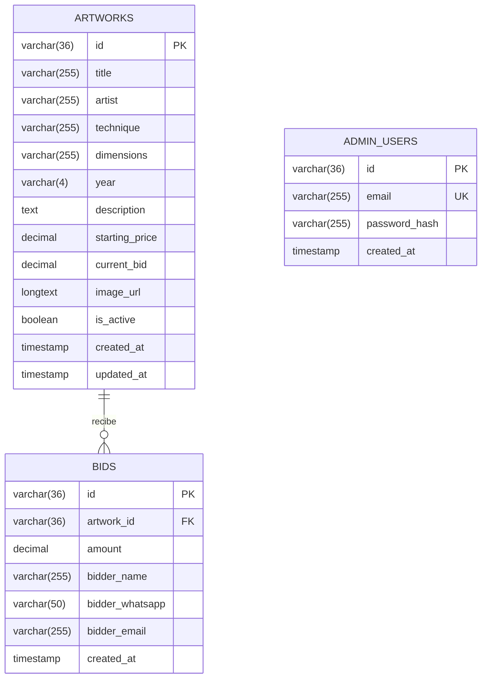

# Modelo de datos — Subasta de Arte con Causa

> [← Volver al README](../README.md) · [Back to README (EN)](../README.en.md)

Tres tablas en MySQL 8. El esquema ejecutable está en [`database.sql`](../database.sql) y se aplica con
`pnpm db:setup`.

---

## Diagrama



`admin_users` no tiene relación con las otras dos: quien administra no puja, y una puja no pertenece a una cuenta.
Eso es consecuencia directa del modelo por contacto — el pujador nunca se registra.

---

## `artworks`

| Columna | Tipo | Notas |
| :--- | :--- | :--- |
| `id` | `VARCHAR(36)` PK | UUID generado por MySQL con `UUID()` |
| `title` | `VARCHAR(255)` | Obligatorio. `S/T` para obras sin título |
| `artist` | `VARCHAR(255)` | Obligatorio |
| `technique` | `VARCHAR(255)` | Obligatorio. Ej. `CERÁMICA BAJA TEMPERATURA` |
| `dimensions` | `VARCHAR(255)` | Texto libre: las medidas de una escultura y las de un lienzo no se expresan igual |
| `year` | `VARCHAR(4)` | Cadena, no entero: hay obras sin año y no todas las fechas son limpias |
| `description` | `TEXT` | Opcional |
| `starting_price` | `DECIMAL(10,2)` | Precio de salida fijado por la organización |
| `current_bid` | `DECIMAL(10,2)` | Puja más alta recibida. `0.00` mientras no haya ninguna |
| `image_url` | `LONGTEXT` | *Data URI* Base64 completo — ver la nota siguiente |
| `is_active` | `BOOLEAN` | `false` retira la obra del catálogo público sin borrarla ni perder sus pujas |
| `created_at` / `updated_at` | `TIMESTAMP` | `updated_at` se refresca solo con `ON UPDATE CURRENT_TIMESTAMP` |

### Por qué `DECIMAL` y no `FLOAT`

Son importes de dinero. `FLOAT` y `DOUBLE` no representan exactamente valores decimales, y en una subasta un
céntimo perdido en un redondeo es un error contable. `DECIMAL(10,2)` almacena el valor exacto y admite hasta
99.999.999,99.

`mysql2` los devuelve como **cadenas** precisamente para no perder esa precisión al convertirlos al `number` de
JavaScript. Por eso [`lib/types.ts`](../lib/types.ts) los normaliza explícitamente antes de que lleguen a la
interfaz.

### Por qué `image_url` es `LONGTEXT`

Guarda la imagen entera codificada en Base64, no una ruta. `TEXT` se queda en 64 KB, insuficiente para una foto:
por eso existe la migración a `LONGTEXT` (hasta 4 GB) en `/api/migrate`.

La justificación de guardar imágenes en la base de datos, y su coste medido —**6,26 MB de catálogo para 14
obras**—, están en [`ARCHITECTURE.md § 3.2`](ARCHITECTURE.md#32-imágenes-en-base64-dentro-de-la-base-de-datos).

### Por qué `current_bid` está desnormalizado

Podría calcularse con `SELECT MAX(amount) FROM bids WHERE artwork_id = ?`. Se guarda en la fila porque el
catálogo lo pide para cada obra en cada carga, y porque tenerlo ahí permite bloquear **una sola fila** con
`FOR UPDATE` al validar una puja. Es una desnormalización deliberada al servicio de la corrección, no solo de la
velocidad.

El histórico completo no se pierde: vive en `bids`.

---

## `bids`

| Columna | Tipo | Notas |
| :--- | :--- | :--- |
| `id` | `VARCHAR(36)` PK | UUID |
| `artwork_id` | `VARCHAR(36)` FK | → `artworks.id`, `ON DELETE CASCADE` |
| `amount` | `DECIMAL(10,2)` | Importe pujado |
| `bidder_name` | `VARCHAR(255)` | Nombre de contacto |
| `bidder_whatsapp` | `VARCHAR(50)` | Canal por el que se cierra el trato |
| `bidder_email` | `VARCHAR(255)` | Contacto alternativo |
| `created_at` | `TIMESTAMP` | Momento de la puja |

**Es un registro append-only.** Ninguna puja se actualiza ni se borra: cuando llega una mayor, se inserta una
fila nueva y `artworks.current_bid` se actualiza. Así la organización puede reconstruir la puja por una obra
completa, y contactar al segundo interesado si el ganador se cae.

> 🔒 Esta tabla contiene datos personales. Es la única razón por la que `/api/admin/bids` está detrás de sesión, y
> la razón por la que la verificación de esa sesión tuvo que dejar de basarse en un identificador sin firmar.

`ON DELETE CASCADE` implica que **borrar una obra borra su histórico de pujas**. Para retirar una pieza del
catálogo sin perder nada, la operación correcta es `is_active = false`.

---

## `admin_users`

| Columna | Tipo | Notas |
| :--- | :--- | :--- |
| `id` | `VARCHAR(36)` PK | UUID. Va dentro de la cookie de sesión, firmado |
| `email` | `VARCHAR(255)` UNIQUE | Se normaliza a minúsculas antes de consultar |
| `password_hash` | `VARCHAR(255)` | bcrypt con coste 12. **Nunca la contraseña en claro** |
| `created_at` | `TIMESTAMP` | |

Los usuarios se crean con [`scripts/create-admin.mjs`](../scripts/create-admin.mjs), que lee `ADMIN_EMAIL` y
`ADMIN_PASSWORD` del entorno y rechaza contraseñas de menos de 12 caracteres. El script usa
`ON DUPLICATE KEY UPDATE`, así que ejecutarlo con un correo existente **cambia la contraseña** — es también el
procedimiento de rotación.

```bash
ADMIN_EMAIL=admin@ejemplo.org ADMIN_PASSWORD='...' pnpm db:admin
```

> Nunca escribas una contraseña dentro de un archivo versionado. Lo que entra en el historial de git se queda ahí
> aunque después borres la línea.

---

## Consultas destacadas

**Catálogo público** — [`app/api/artworks/route.ts`](../app/api/artworks/route.ts)

```sql
SELECT * FROM artworks WHERE is_active = true ORDER BY created_at DESC;
```

**Validar y registrar una puja, sin condición de carrera** — [`app/api/bids/route.ts`](../app/api/bids/route.ts)

```sql
START TRANSACTION;

SELECT current_bid, starting_price FROM artworks
WHERE id = ? AND is_active = true
FOR UPDATE;                             -- bloquea la fila hasta el COMMIT

-- (validación del mínimo en la aplicación)

INSERT INTO bids (id, artwork_id, amount, bidder_name, bidder_whatsapp, bidder_email)
VALUES (UUID(), ?, ?, ?, ?, ?);

UPDATE artworks SET current_bid = ? WHERE id = ?;

COMMIT;
```

**Pujas con su obra, sin N+1** — [`app/api/admin/bids/route.ts`](../app/api/admin/bids/route.ts)

```sql
SELECT b.*,
       a.id AS a_id, a.title AS a_title, a.artist AS a_artist, a.image_url AS a_image_url
FROM bids b
LEFT JOIN artworks a ON b.artwork_id = a.id
ORDER BY b.created_at DESC;
```

Las columnas de la obra se traen con prefijo `a_` y se reagrupan en un objeto anidado en la aplicación: una sola
consulta en lugar de una por puja.

---

## Índices

El esquema declara claves primarias en las tres tablas y `UNIQUE` sobre `admin_users.email`. La clave foránea
`bids.artwork_id` crea su índice automáticamente en InnoDB.

Con el volumen actual —14 obras y decenas de pujas— no hace falta nada más. Si el histórico creciera, el primer
índice que merecería la pena sería:

```sql
CREATE INDEX idx_bids_artwork_created ON bids (artwork_id, created_at DESC);
```

para el filtrado de pujas por obra en el panel.
